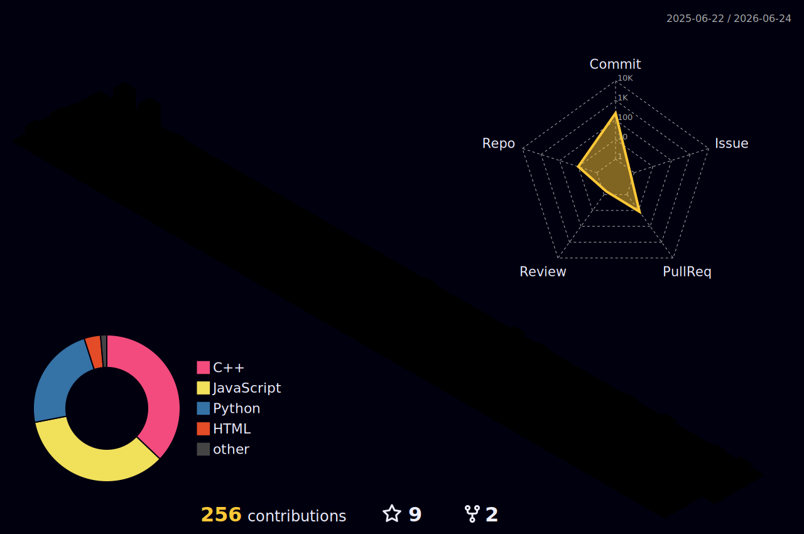

<!--              Profile Banner              -->

  

# About Me

I'm a Computer Engineering student from Nepal who loves writing clean, purposeful code.

I started with **C and C++** to build a strong foundation, then picked up **Python** for scripting and automation, and **JavaScript** for the web. Right now I'm deep into **frontend development** and experimenting with backend APIs using the **Drogon Framework**.

Outside of coursework, I enjoy tinkering with my **Arch Linux** setup, building small tools that solve real problems, and exploring how things work under the hood.

I'm still early in my journey — but I ship code, break things, and learn fast.

### A few things about me

- Based in **Dharan, Nepal**
- Currently building **Frontend Projects & REST APIs**
- Learning **React, Tailwind CSS, TypeScript & Systems Programming**
- Always improving through code and curiosity
- Reach me: **contact@safalgautam.com.np**

 

---

# Tech Stack & Tools

## Languages

## Web & UI

## Tools & Environment

---

# Top Projects

| Project | Description | Tech |
|:---------|:------------|:----|
| **[`URL Shortener`](https://github.com/safalbuilds/url_shortner)** | Production-ready URL shortener with analytics, PostgreSQL, Docker and TypeScript backend. | TypeScript • Express • PostgreSQL |
| **[`Portfolio Website`](hthttps://github.com/safalbuilds/safalgautam.com.np)** | Personal portfolio showcasing projects, skills and experience with integrated blog md -> html backend system. | React • Express • Tailwind CSS |
| **[`Password Manager API`](hthttps://github.com/safalbuilds/pwdmanager_api)** | Modern C++ Password Manager API built with Drogon, featuring API key authentication, JSON storage, and basic encrypted password handling. | C++ |

---

# Connect With Me

---

# GitHub Statistics

  
  

  

---

# Contribution Graph

  

---

# 3D Contribution Graph

  

---

# Visitor Counter

---

<b>Building one project at a time: code, learn, improve. 🚀</b>

