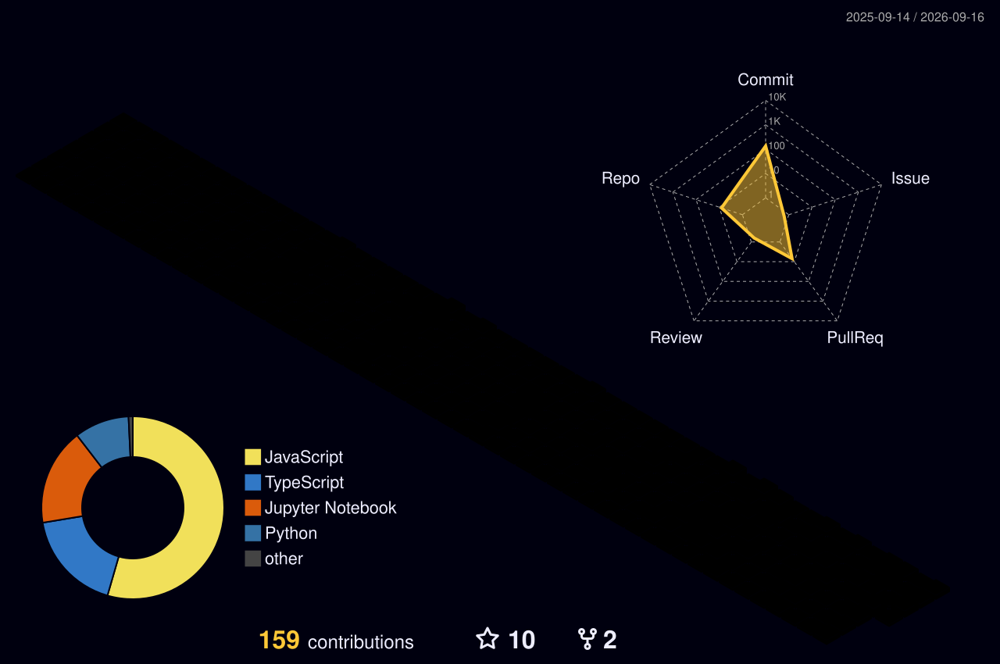

<!--              Profile Banner              -->
<p align="center">
  
</p>

<h2 align="center"><code>── About Me ──</code></h2>

<p align="center">
  
</p>

<br/>

---

<h2 align="center"><code>── Tech Stack & Tools ──</code></h2>

```bash
.
├── Languages
│   ├── C
│   ├── C++
│   ├── Python
│   ├── JavaScript
│   └── Jupyter Notebook
├── Web & UI
│   ├── HTML5
│   ├── CSS3
│   ├── Tailwind CSS
│   ├── React
│   ├── TypeScript
│   └── Figma
└── Tools & Environment
    ├── Git
    ├── Linux
    ├── Arch Linux
    └── Drogon Framework
```

---

<h2 align="center"><code>── Top Projects ──</code></h2>

| Project | Description | Tech |
|:---------|:------------|:----|
| **[`URL Shortener`](https://github.com/safalbuilds/url_shortner)** | Production-ready URL shortener with analytics, PostgreSQL, Docker and TypeScript backend. | TypeScript • Express • PostgreSQL |
| **[`Portfolio Website`](https://github.com/safalbuilds/safalgautam.com.np)** | Personal portfolio showcasing projects, skills and experience with integrated blog md -> html backend system. | React • Express • Tailwind CSS |
| **[`Password Manager API`](https://github.com/safalbuilds/pwdmanager_api)** | Modern C++ Password Manager API built with Drogon, featuring API key authentication, JSON storage, and basic encrypted password handling. | C++ |

---

<h2 align="center"><code>── Connect With Me ──</code></h2>

<p align="center">

<a href="mailto:contact@safalgautam.com.np">

</a>

<a href="https://github.com/safalbuilds">

</a>

<a href="https://linkedin.com/in/safalbuilds">

</a>

</p>

---

<h2 align="center"><code>── Statistics ──</code></h2>

<p align="center">
  
</p>

<p align="center">
  
  &nbsp;&nbsp;&nbsp;&nbsp;
  
</p>

<p align="center">
  
</p>

<h3 align="center"><code>── 3d-contribution graph ──</code></h3>
<p align="center">
  
</p>

<p align="center">
  
</p>

---

<p align="center">
<b>Building one project at a time: code, learn, improve. 🚀</b>
</p>